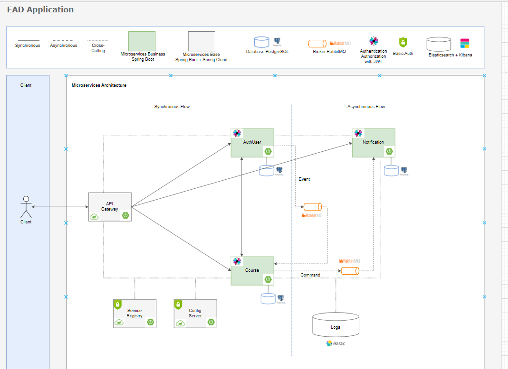

# EAD - API AUTHUSER

## Sobre o projeto
Projeto Decoder EAD - Arquitetura de microservices, tem como maior
objetivo colocar em prática todos os conceitos abordados.

Cada funcionalidade da plataforma é abordada como um serviço independente, promovendo flexibilidade e isolamento de responsabilidades.

### Alguns dos conceitos abordados ao longo do projeto
`Shared Database Pattern`
`Event Driven Pattern`
`Comunicação por Coreografia`
`Authentication e Authorization com JWT`
`Observability`
`SAGA Pattern`
`Cross
Cutting`
`Event Carried State Transfer Pattern`

### Desenho da solução


## Sobre a API
`authUser` é uma parte fundamental do projeto "EAD - Plataforma de Ensino", dedicada à gestão de usuários na plataforma. Suas principais responsabilidades incluem:

- **Cadastro de Usuário:** Permite a criação de novos usuários, facilitando a entrada de novos alunos e instrutores na plataforma.

- **Autenticação de Usuário:** Fornece mecanismos seguros para autenticação, garantindo acesso protegido e personalizado aos recursos da plataforma.

- **Designação de Instrutor:** Possibilita a transição de usuários para o papel de instrutor, concedendo as permissões necessárias para a criação e gerenciamento de conteúdo educacional.

## Endpoints
`POST SIGN UP - http://localhost:8080/ead-authuser/auth/signup`

`POST INSTRUCTOR SUBSCRIPTION - http://localhost:8080/ead-authuser/instructors/subscription`

`POST LOGIN - http://localhost:8080/ead-authuser/auth/login`

`GET AL USERS - http://localhost:8080/ead-authuser/users`

`GET ONE USER - http://localhost:8080/ead-authuser/users/{user_id}`

`GET ALL COURSES BY userId - http://localhost:8080/ead-authuser/users/{user_id}/courses`

`PUT USER- http://localhost:8080/ead-authuser/users/{user_id}`

`PUT PASSWORD - http://localhost:8080/users/{user_id}/password`

`PUT IMAGE http://localhost:8080/users/{user_id}/image`

`DELETE - http://localhost:8080/ead-authuser/users/{user_id}`

## Tecnologias utilizadas
- Java 11
- Spring boot
- Maven
- Eureka Client
- Spring Logging 
- Spring AMQP
- Spring Actuator
- Spring Circuit breaker Resilience4j
- Spring Log4j2
- Spring Postgresql
- Spring Lombok
- Spring Data JPA
- Spring Security
- jjwt

## Como executar o projeto
- Pré-requisitos: Java 11
- Ter os seguinte projetos em execução:
    - Service Registry
    - Config Server
    - Api Gateway

```bash
# clonar repositório
git clone https://github.com/alinepazz/sistema-ead-microservice-api-authuser.git

# entrar na pasta raiz do projeto

# executar o projeto
mvn spring-boot:run
```
### Autor
Aline Soares da Paz

https://www.linkedin.com/in/alinepazz/
